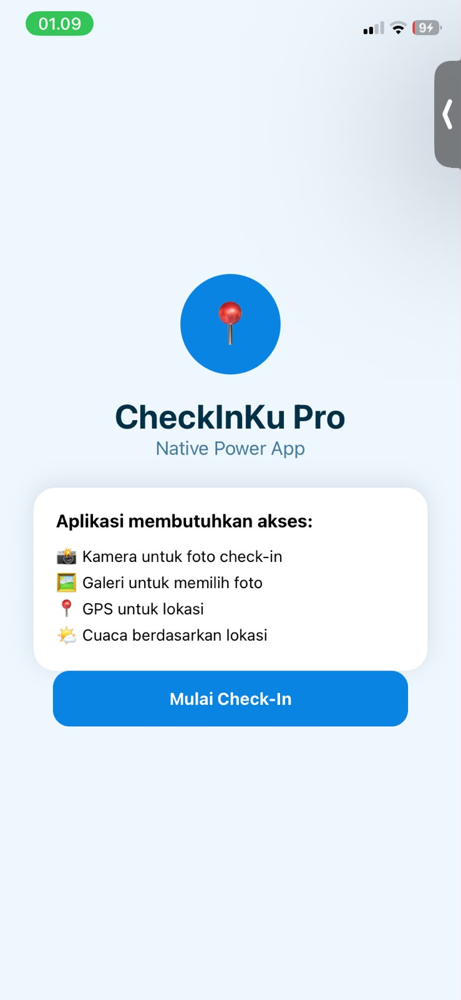
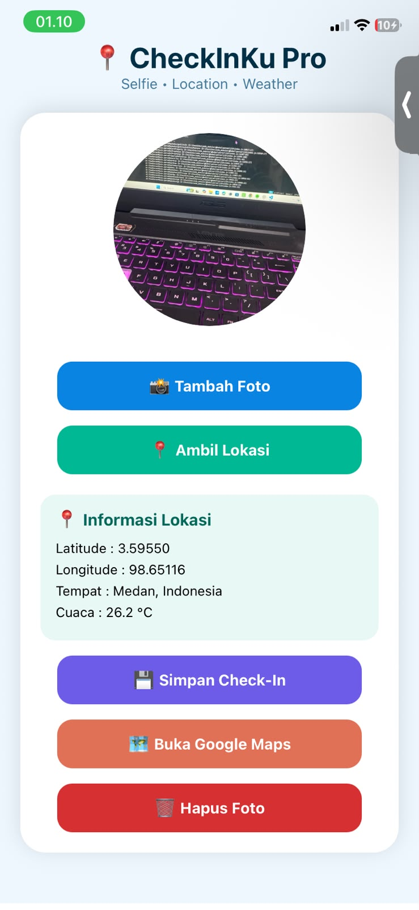
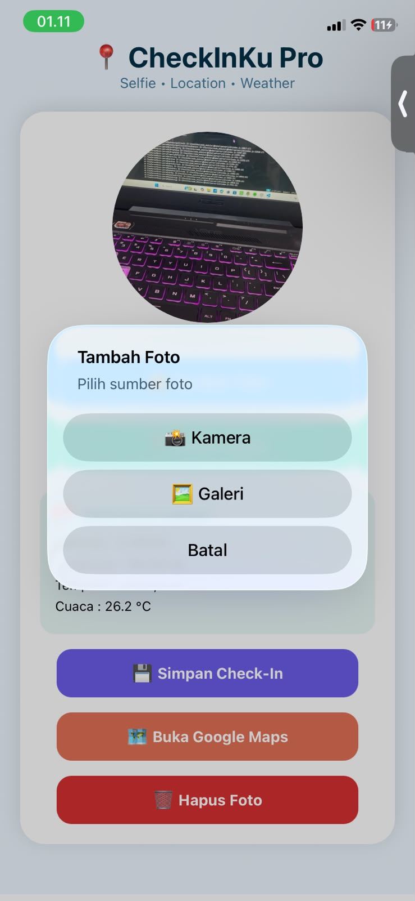
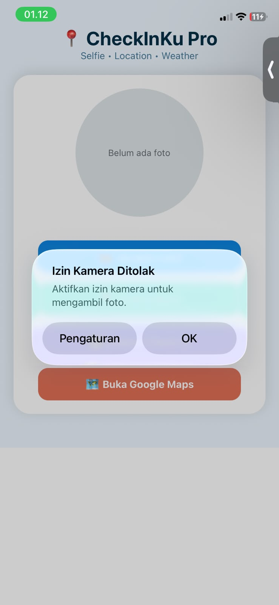
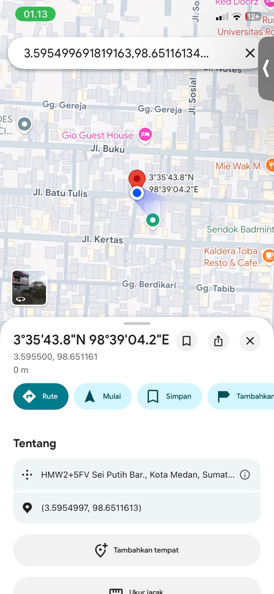

# 📍 CheckInKu Pro - Native Power App

## 📱 Deskripsi Aplikasi

CheckInKu Pro merupakan aplikasi mobile berbasis React Native Expo yang memanfaatkan fitur native smartphone seperti kamera, galeri, GPS, dan akses lokasi.

Aplikasi ini dibuat untuk melakukan proses check-in digital menggunakan foto, koordinat lokasi pengguna, informasi tempat, serta kondisi cuaca berdasarkan lokasi pengguna.

Aplikasi ini menerapkan permission flow yang aman dengan meminta izin akses terlebih dahulu, melakukan pengecekan status izin, serta menangani penolakan izin tanpa menyebabkan aplikasi mengalami crash.

## 🚀 Fitur Aplikasi

### Level 1 - Core Features

✅ Kamera untuk mengambil foto check-in  
✅ Galeri untuk memilih foto  
✅ GPS untuk mengambil lokasi pengguna  
✅ Menampilkan latitude dan longitude  
✅ Permission request dan pengecekan status izin  
✅ Alert ketika izin ditolak  
✅ Tampilan foto menggunakan URI

## ⭐ Level 2 - Pengembangan Fitur

✅ Kamera + Galeri  
Pengguna dapat memilih sumber foto melalui dialog pilihan Kamera atau Galeri.

✅ Kamera + Lokasi  
Foto check-in digabungkan dengan informasi lokasi pengguna.

✅ Persistensi Data (AsyncStorage)  
Data foto, lokasi, dan informasi check-in dapat disimpan dan dimuat kembali ketika aplikasi dibuka.

✅ Google Maps Integration  
Pengguna dapat membuka lokasi check-in langsung melalui Google Maps.

✅ Tombol Pengaturan Permission  
Pengguna dapat diarahkan menuju pengaturan perangkat ketika izin ditolak.

## 🌟 Bonus Level 3

✅ Priming Screen  
Memberikan informasi kepada pengguna sebelum meminta izin akses.

✅ Reverse Geocoding  
Mengubah koordinat GPS menjadi nama lokasi.

✅ Weather API  
Menampilkan kondisi cuaca berdasarkan koordinat pengguna.

✅ app.json Permission Configuration  
Konfigurasi pesan izin kamera, galeri, dan lokasi.

# 🛠️ Teknologi yang Digunakan

- React Native
- Expo
- Expo Image Picker
- Expo Location
- AsyncStorage
- Linking API
- Open-Meteo Weather API

# 📸 Screenshot Aplikasi

## 1. Priming Screen

## 2. Foto + Lokasi + Cuaca

## 3. Kamera dan Galeri Picker

## 4. Permission Ditolak

## 5. Google Maps

# ▶️ Cara Menjalankan Project

Clone repository: