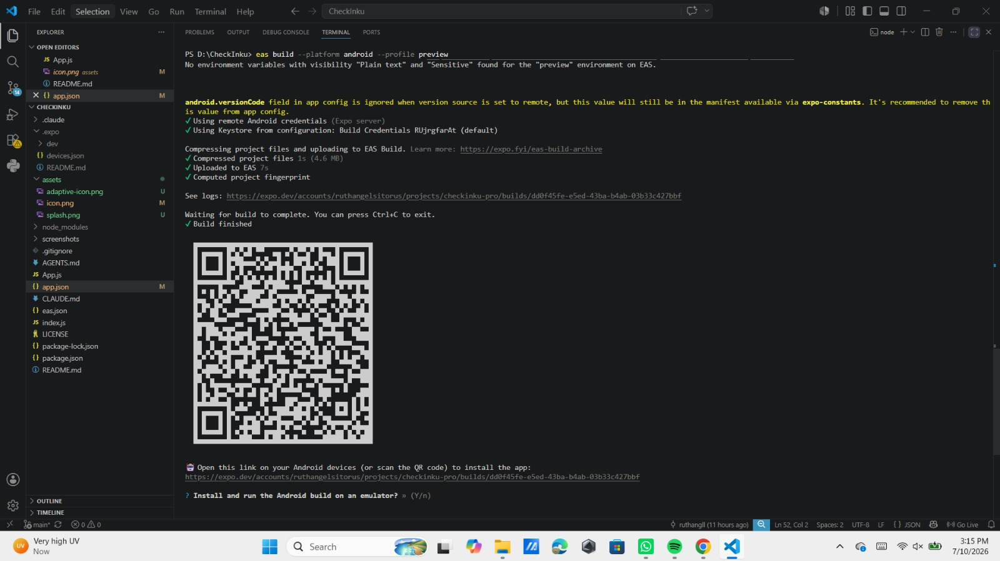
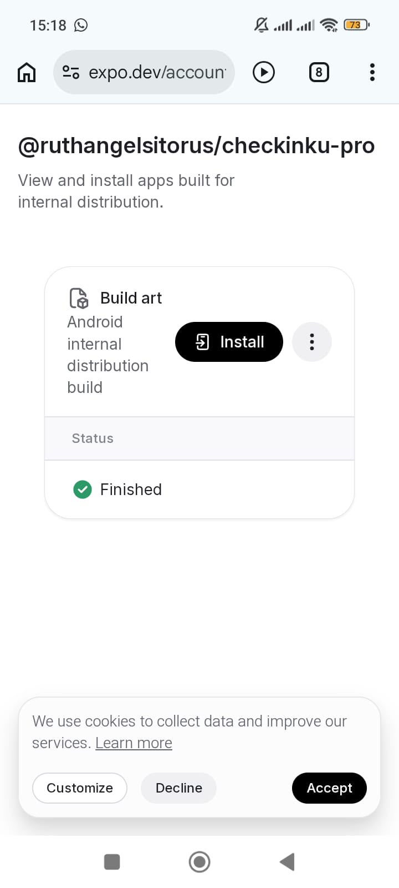
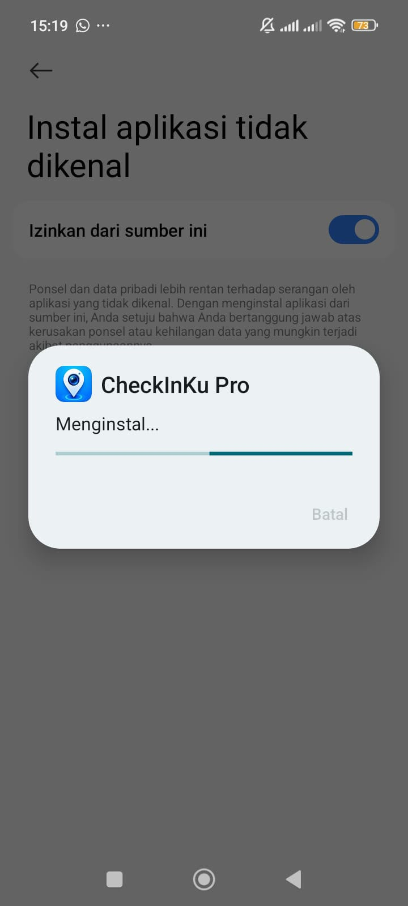
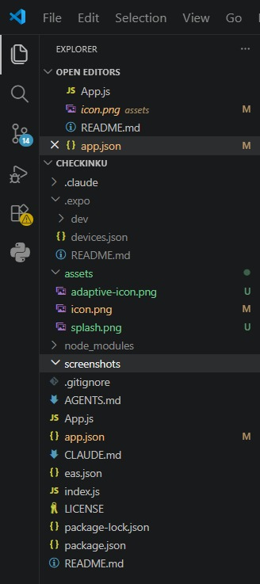
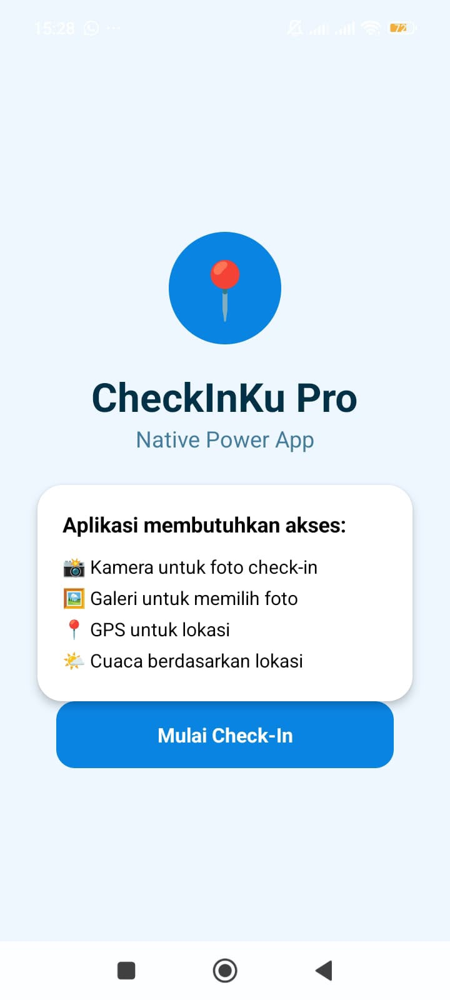
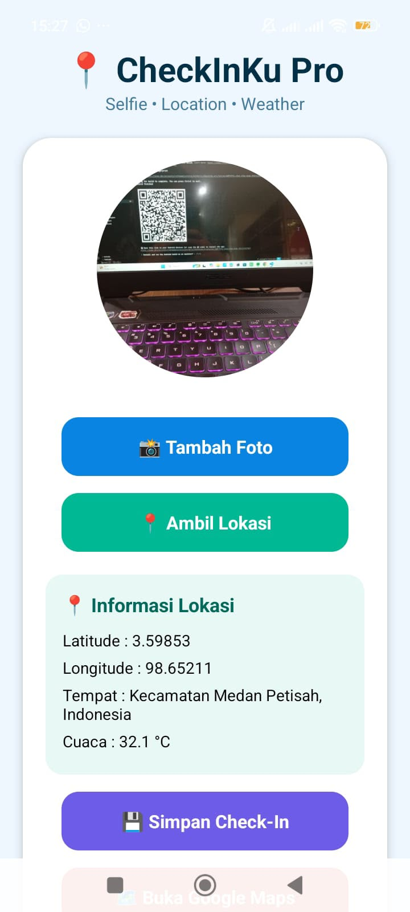
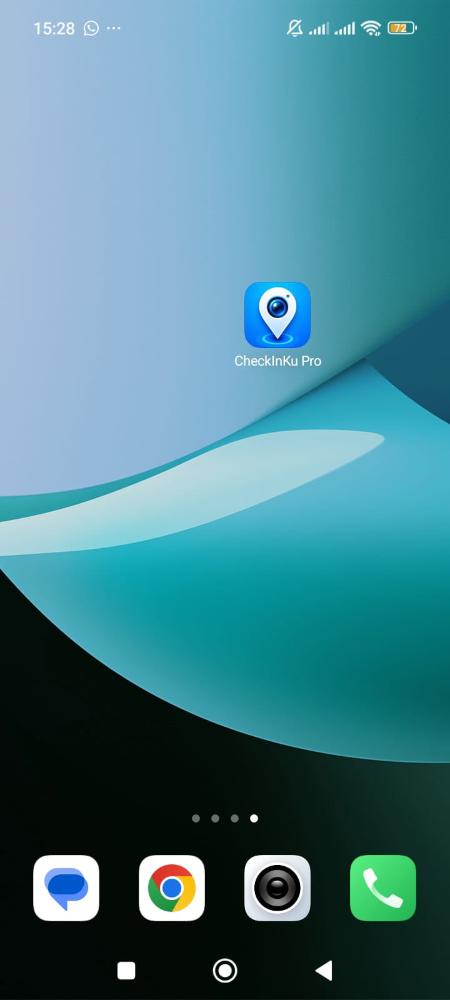

# 📍 CheckInKu Pro

## 🚀 Release Candidate — React Native Expo + EAS Build

CheckInKu Pro merupakan aplikasi mobile berbasis **React Native Expo** yang memanfaatkan fitur native smartphone seperti kamera, galeri, GPS, dan permission system.

Aplikasi ini digunakan untuk melakukan proses **check-in digital** dengan mengambil foto, memperoleh lokasi pengguna secara real-time, menampilkan koordinat GPS, informasi lokasi, serta informasi cuaca berdasarkan lokasi pengguna.

Project ini dikembangkan sebagai implementasi **Misi 14 — Menyiapkan Aplikasi untuk Rilis (Release Candidate)** pada mata kuliah Praktik Pemrograman Mobile (React Native).

Tahapan pengembangan meliputi:

- Konfigurasi aplikasi menggunakan Expo.
- Pengaturan app.json.
- Pembuatan custom icon dan splash screen.
- Proses EAS Build.
- Menghasilkan APK Android.
- Instalasi APK pada perangkat Android tanpa menggunakan Expo Go.

---

# 📱 Fitur Utama Aplikasi

## 📸 Camera Check-In

Aplikasi menggunakan kamera smartphone untuk mengambil foto sebagai dokumentasi aktivitas check-in.

Implementasi:

- Meminta izin akses kamera.
- Membuka kamera perangkat.
- Mengambil foto menggunakan kamera.
- Menampilkan hasil foto pada aplikasi.

---

## 🖼 Gallery Integration

Pengguna dapat memilih foto dari galeri perangkat.

Implementasi:

- Meminta izin akses galeri.
- Membuka penyimpanan gambar perangkat.
- Memilih foto pengguna.
- Menampilkan foto pilihan pada halaman aplikasi.

---

## 📍 GPS Location

Aplikasi menggunakan GPS perangkat untuk mendapatkan lokasi pengguna.

Informasi yang ditampilkan:

- Latitude.
- Longitude.
- Nama lokasi.
- Informasi lokasi berdasarkan koordinat GPS.

---

## 🌤 Weather Information

Aplikasi menampilkan informasi cuaca berdasarkan lokasi pengguna.

Fitur:

- Mengambil koordinat lokasi pengguna.
- Menghubungkan lokasi dengan layanan cuaca.
- Menampilkan kondisi cuaca berdasarkan lokasi.

---

# 🔐 Native Permission System

Aplikasi menerapkan sistem permission native Android.

Permission yang digunakan:

### CAMERA

Digunakan untuk mengambil foto check-in melalui kamera perangkat.

### READ_MEDIA_IMAGES

Digunakan untuk memilih foto dari galeri.

### ACCESS_FINE_LOCATION

Digunakan untuk mendapatkan lokasi pengguna melalui GPS.

Apabila permission ditolak, aplikasi tetap berjalan tanpa mengalami crash.

---

# 📦 Release Build Information

## EAS Build Configuration

Aplikasi telah dikonfigurasi menggunakan:

- Expo Application Services (EAS)
- EAS CLI
- Android APK Build

Build Profile

```text
preview
```

Output

```text
Android APK
```

Perintah build

```bash
eas build --platform android --profile preview
```

Status Build

```text
FINISHED ✅
```

---

# 📥 APK Installation

APK hasil build dapat di-install langsung pada perangkat Android tanpa menggunakan Expo Go.

## 🔗 EAS Build Link

https://expo.dev/accounts/ruthangelsitorus/projects/checkinku-pro/builds/dd0f45fe-e5ed-43ba-b4ab-03b33c427bbf

Melalui link tersebut pengguna dapat melihat hasil build EAS dan melakukan instalasi APK.

---

# 🎨 Build Assets

Aplikasi menggunakan asset custom untuk kebutuhan release.

## App Icon

<p align="center">

</p>

File

```text
assets/icon.png
```

Spesifikasi

- Format PNG.
- Ukuran 1024 × 1024 px.
- Desain khusus aplikasi CheckInKu Pro.

---

## Adaptive Icon

<p align="center">

</p>

File

```text
assets/adaptive-icon.png
```

Digunakan sebagai icon launcher Android dengan logo berada di tengah dan memiliki padding.

---

## Splash Screen

<p align="center">

</p>

File

```text
assets/splash.png
```

Digunakan sebagai tampilan awal aplikasi saat aplikasi dibuka.

Background

```text
#0A84FF
```

---

# 📸 Screenshot Bukti Aplikasi

Screenshot dokumentasi tersedia pada folder

```text
screenshots/
```

## 1. EAS Build Finished



---

## 2. EAS Dashboard Build



---

## 3. Instalasi APK



---

## 4. Struktur Project



---

## 5. Splash Screen Aplikasi


---

## 6. Permission Screen



---

## 7. Halaman Check-In Camera & Location



---

## 8. Icon Aplikasi pada Home Screen



---

# 🛠 Tech Stack

Teknologi yang digunakan

- React Native
- Expo
- JavaScript
- Expo Image Picker
- Expo Location
- AsyncStorage
- Linking API
- Open-Meteo Weather API
- Expo Application Services (EAS)

---

# ▶️ Cara Menjalankan Project

## 1. Clone Repository

```bash
git clone https://github.com/ruthangll/CheckInKu-Pro.git
```

## 2. Masuk Folder Project

```bash
cd CheckInKu-Pro
```

## 3. Install Dependency

```bash
npm install
```

## 4. Jalankan Project

```bash
npx expo start
```

Aplikasi dapat dijalankan menggunakan:

- Expo Go.
- Android APK hasil EAS Build.

---

# 🔗 Expo Snack

Versi interaktif aplikasi dapat dicoba melalui Expo Snack

https://snack.expo.dev/@ruthangelsitorus/checkinku-proo

---

# 📂 Struktur Project

```text
CheckInKu-Pro
│
├── App.js
├── app.json
├── eas.json
├── package.json
├── README.md
│
├── assets
│   ├── icon.png
│   ├── adaptive-icon.png
│   └── splash.png
│
└── screenshots
    ├── 01_eas_build_finished.jpeg
    ├── 02_eas_dashboard_finished.jpeg
    ├── 03_install_apk.jpeg
    ├── 04_project_structure.jpeg
    ├── 05_splash_screen_aplikasi.jpeg
    ├── 06_home_permission_screen.jpeg
    ├── 07_checkin_camera_location_screen.jpeg
    └── 08_app_icon_home_screen.jpeg
```

---

# 👩‍💻 Developer

**Ruth Angel Sitorus**

Universitas Prima Indonesia

Mata Kuliah

Praktek Pemrograman Mobile (React Native)

Project

**CheckInKu Pro**
